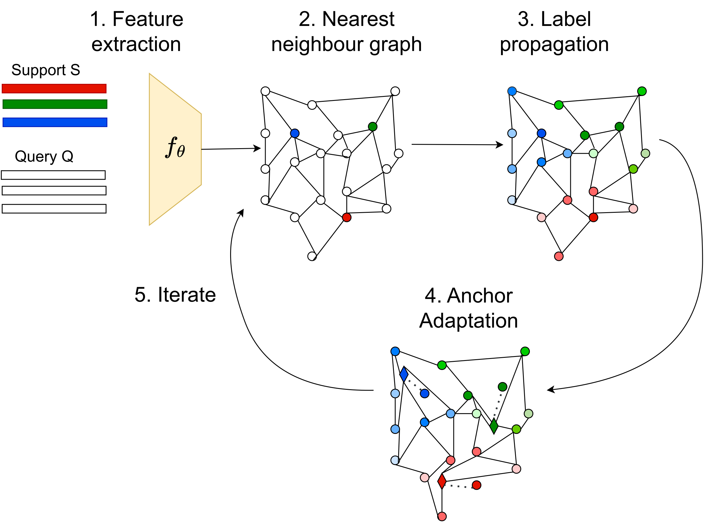

# A2LP

This repo covers the implementation of the following paper: 

**"Adaptive anchor label propagation for transductive few-shot learning (ICIP 2023)"** [Paper](https://openaccess.thecvf.com/content/ICCV2021/html/Lazarou_Iterative_Label_Cleaning_for_Transductive_and_Semi-Supervised_Few-Shot_Learning_ICCV_2021_paper.html)
<p align='center'>
  
</p>

## Abstract

Few-shot learning addresses the issue of classifying images using limited labeled data. Exploiting unlabeled data through the use of transductive inference methods such as label propagation has been shown to improve the performance of few-shot learning significantly. Label propagation infers pseudo-labels for unlabeled data by utilizing a constructed graph that exploits the underlying manifold structure of the data. However, a limitation of the existing label propagation approaches is that the positions of all data points are fixed and might be sub-optimal so that the algorithm is not as effective as possible. In this work, we propose a novel algorithm that adapts the feature embeddings of the labeled data by minimizing a differentiable loss function optimizing their positions in the manifold in the process. Our novel algorithm, Adaptive Anchor Label Propagation, outperforms the standard label propagation algorithm by as much as 7% and 2% in the 1-shot and 5-shot settings respectively. We provide experimental results highlighting the merits of our algorithm on four widely used few-shot benchmark datasets, namely miniImageNet, tieredImageNet, CUB and CIFAR-FS and two commonly used backbones, ResNet12 and WideResNet-28-10.


If you find this repo useful for your research, please consider citing the paper
```
@inproceedings{lazarou2023adaptive,
  title={Adaptive anchor label propagation for transductive few-shot learning},
  author={Lazarou, Michalis and Avrithis, Yannis and Ren, Guangyu and Stathaki, Tania},
  booktitle={2023 IEEE International Conference on Image Processing (ICIP)},
  year={2023},
  organization={IEEE}
}
```
## Datasets

We carry out experiments using pre-trained ResNet-12 and WRN-28-10 backbones. The extracted features for both backbones for every dataset can be found in the directory checkpoints/#DATASETNAME/#BACKBONE_S2M2_R/last/output.pkl

For all of our experiments regarding WRN-28-10 backbone, we used the pre-trained features provided by [S2M2_fewshot](https://github.com/nupurkmr9/S2M2_fewshot) and can also be downloaded from here [checkpoints](https://drive.google.com/drive/folders/1KfPzwMvVzybvp13IQW5ipHvSxBncTA-C).

For resnet12 experiments we extracted the features using the pre-trained networks provided by [LR+ICI](https://github.com/Yikai-Wang/ICI-FSL) and used the datasets provided by [S2M2_fewshot](https://github.com/nupurkmr9/S2M2_fewshot) for tieredImagenet, CIFAR-FS and CUB experiments. For the miniImagenet dataset we used the .pkl files provided from here [miniImagenet_pkl](https://drive.google.com/file/d/1fJAK5WZTjerW7EWHHQAR9pRJVNg1T1Y7/view).


## Running
**Note** to reproduce the results of the paper for WRN-28-10 and resnet12 run the following commands respectively:

	python transductive_wrn.py --dataset [DATASETNAME] --algorithm [ALGORITHMNAME] --alpha 0.8 --K 20 --n_shots [1/5] --preprocessing [PLC/L2]
	python transductive_res.py --dataset [DATASETNAME] --algorithm [ALGORITHMNAME] --alpha 0.8 --K 20 --n_shots [1/5] --preprocessing [PLC/L2]

for the correct hyperparameters alpha and K for every experiment check table 11. 
WRN-28-10 experiments support all 3 algorithms iLPC,PT-MAP and LR+ICI, resnet12 support only iLPC and LR+ICI

## Contacts
For any questions, please contact:

Michalis Lazarou (ml6414@ic.ac.uk)  

## Acknowlegements
[iLPC](https://github.com/MichalisLazarou/iLPC)

[LR+ICI](https://github.com/Yikai-Wang/ICI-FSL)

[S2M2_fewshot](https://github.com/nupurkmr9/S2M2_fewshot)


